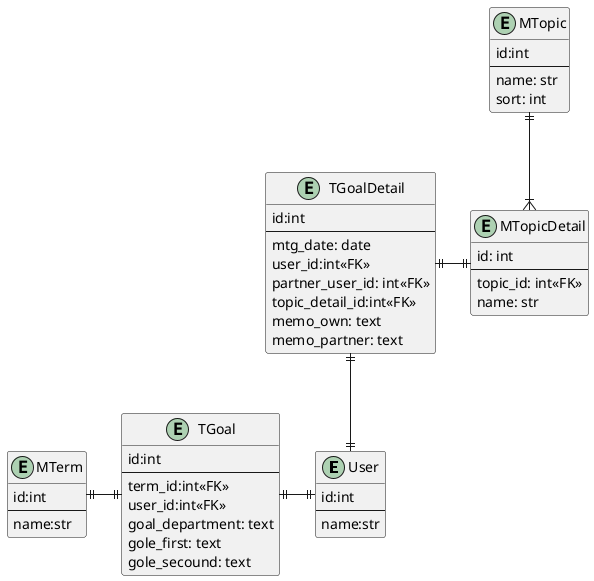

# 月次面談管理システム

## やりたいこと

- 各自の目標の進捗確認
  - 先月の取り組み内容
    - FB 結果のメモ
  - 先月の結果
    - FB 結果のメモ
  - 来月に向けて
    - FB 結果のメモ
- 他の人には参照できないように
  - 基本的には本人と上司のみ
- 面談の日程調整が可能
  - 調整が可能
  - 決まった日付を Slack 通知

## API

### ER

