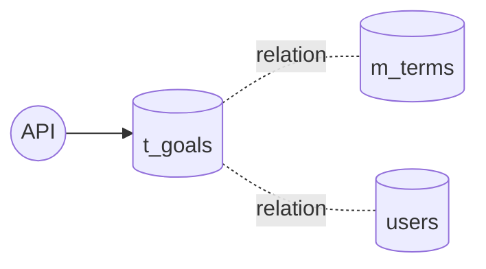
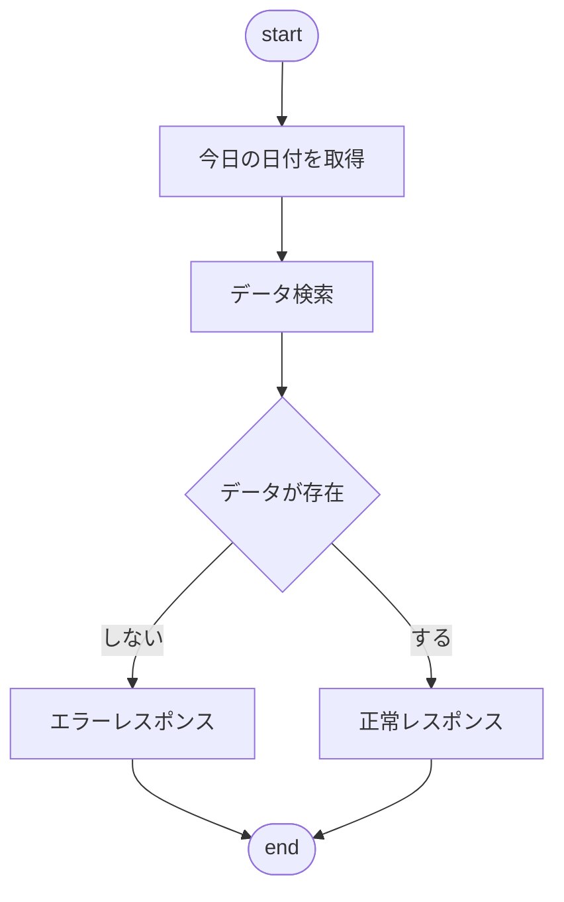
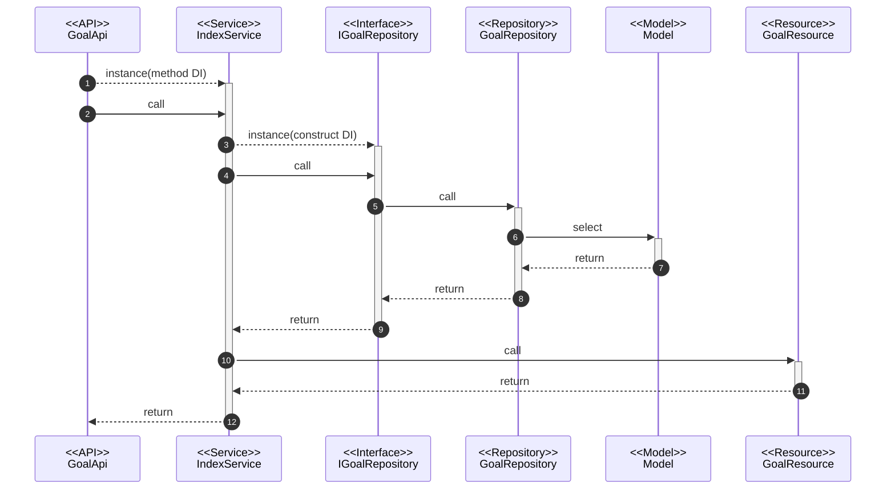

@import "../../090.other/md-css/markdown.less"

# API-004

## 目標（部・目標 1,2）検索 API

### 処理概要

- 期ごとに設定する目標を検索

### データアクセス



#### t_goals(ユーザーマスタ)

- deleted_at = is null

#### m_terms(期間マスタ)

- deleted_at = is null
- from >= 今日
- 今日 < to

#### users(ユーザーマスタ)

- deleted_at = is null

### 処理フロー

#### フローチャート



#### 処理シーケンス



### Request

#### path params

- /goals/{term_id}

#### body params

なし

#### sample json

なし

### Response

#### 200 ステータス

##### base

| key     | type   | value            | note |
| :------ | :----- | :--------------- | :--- |
| data    | array  | GoalResource     |      |
| message | string | 検索完了しました |      |

###### GoalResource

| key             | type   | value                   | note |
| :-------------- | :----- | :---------------------- | :--- |
| goal_id         | int    | t_goals.id              |      |
| term_id         | int    | t_goals.term_id         |      |
| term_name       | string | m_terms.name            |      |
| user_id         | int    | users.id                |      |
| user_name       | string | users.name              |      |
| goal_department | string | t_goals.goal_department |      |
| gole_first      | string | t_goals.gole_first      |      |
| gole_secound    | string | t_goals.gole_secound    |      |

##### sample json

```json5
{
  data: [
    {
      goal_id: 1
      term_id: 1
      term_name: "YYYY年上半期"
      user_id: 1
      user_name: "aaa"
      goal_department: "XXXXXX"
      gole_first: "XXXXXX"
      gole_secound: "XXXXXX"
    }
  ]
}
```

#### 503 ステータス

- Laravel 側の**想定内の例外**は handler.php で制御している
  - 要求を処理できないことを示す 503 ステータスを使用
- 独自例外クラスの AppException を throw したら、下の形式で返される

```json5
{
  message: '※throwされたメッセージ',
}
```

#### 500 ステータス

- Laravel 側の**想定外の例外**は handler.php で制御しているため考慮不要

```json5
{
  message: 'uncatch exception'
  errorFile: '',
  errorLine: '',
  errorDetail: '',
}
```
