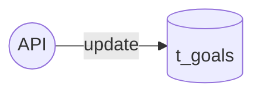
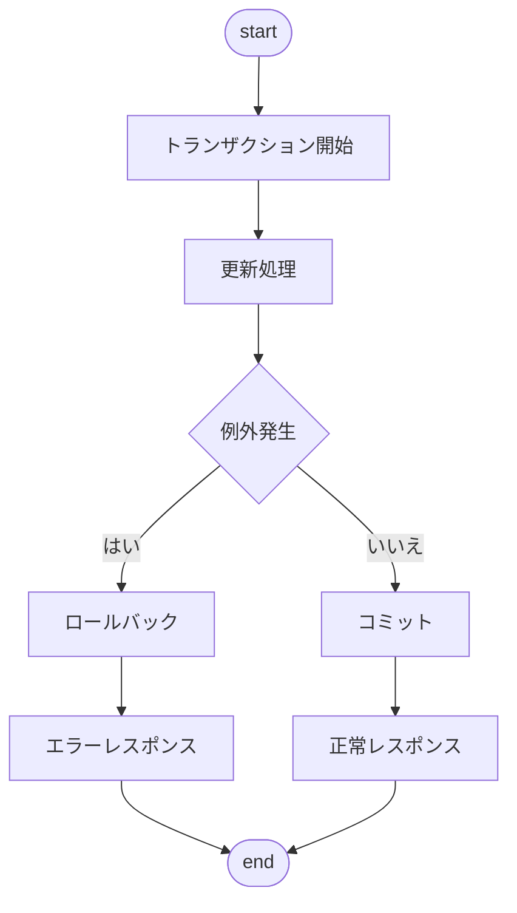
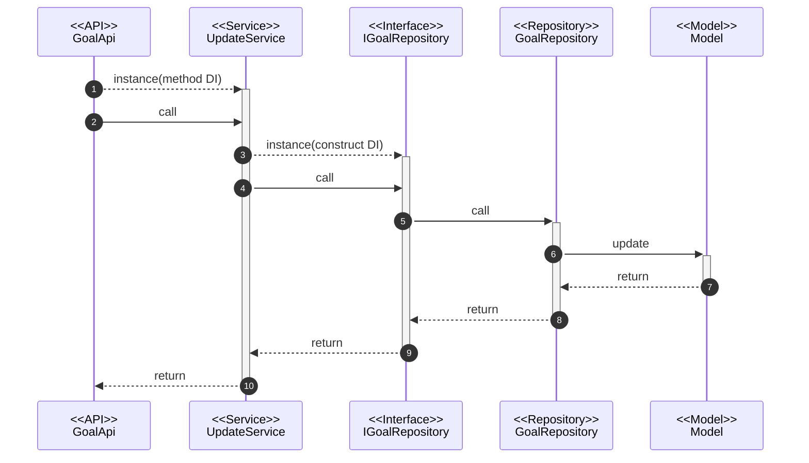

@import "../../090.other/md-css/markdown.less"

# API-005

## 目標更新 API

### 処理概要

- 部目標・目標 1・目標 2 を更新

### データアクセス



#### t_goals(ゴール)

| column          | edit           |
| :-------------- | :------------- |
| goal_department | パラメータ参照 |
| goal_first      | パラメータ参照 |
| goal_secound    | パラメータ参照 |
| updated_at      | 更新日時       |

### 処理フロー

#### フローチャート



#### 処理シーケンス



### Request

#### path params

- /goals/{term_id}

#### body params

##### base

| key  | type  | value          | note |
| :--- | :---- | :------------- | :--- |
| data | array | GoalPutRequest |      |

###### GoalPutRequest

| key             | type   | validation | value | note |
| :-------------- | :----- | :--------- | :---- | :--- |
| goal_department | string |            |       |      |
| goal_first      | string |            |       |      |
| goal_secound    | string |            |       |      |

#### sample json

```json5
{
  data: {
    goal_department: 'XXXXX',
    goal_first: 'XXXXX',
    goal_secound: 'XXXXX',
  },
}
```

### Response

#### 200 ステータス

##### base

| key     | type   | value            | note |
| :------ | :----- | :--------------- | :--- |
| message | string | 更新完了しました |      |

##### sample json

```json5
{
  message: '更新完了しました',
}
```

#### 503 ステータス

- Laravel 側の**想定内の例外**は handler.php で制御している
  - 要求を処理できないことを示す 503 ステータスを使用
- 独自例外クラスの AppException を throw したら、下の形式で返される

```json5
{
  message: '※throwされたメッセージ',
}
```

#### 500 ステータス

- Laravel 側の**想定外の例外**は handler.php で制御しているため考慮不要

```json5
{
  message: 'uncatch exception'
  errorFile: '',
  errorLine: '',
  errorDetail: '',
}
```
