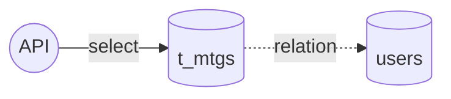
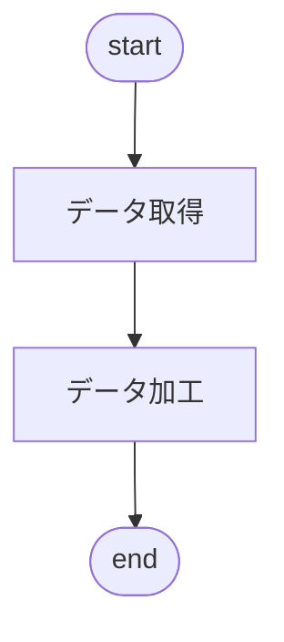
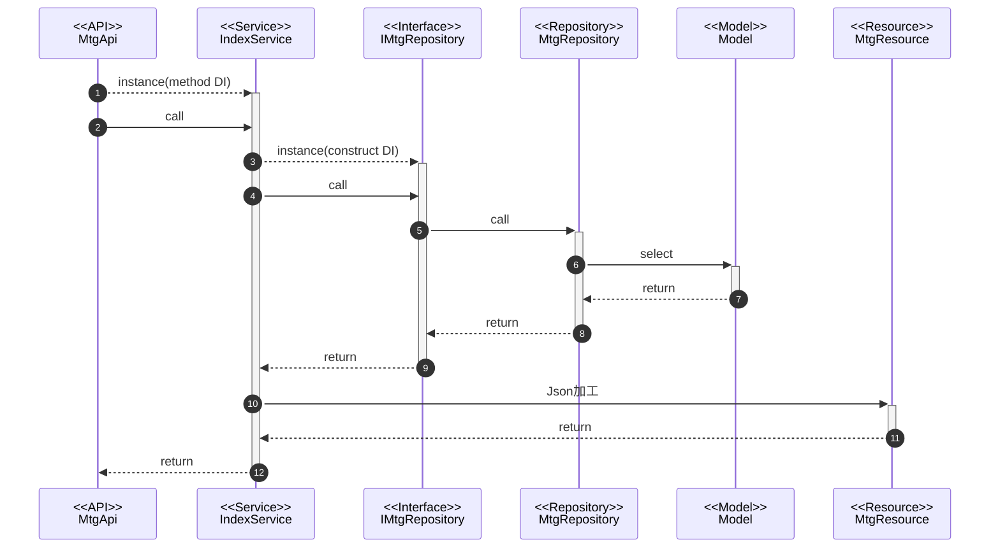

@import "../../090.other/md-css/markdown.less"

# API-006

## MTG 実施履歴一覧検索 API

### 処理概要

- MTG の親情報を取得

### データアクセス



#### t_mtgs(ミーティング)

- 編集なし

### 処理フロー

#### フローチャート



#### 処理シーケンス



### Request

#### URI

- GET
  - api/my-goal/v1/mtgs

#### path params

- なし

#### body params

##### base

#### sample json

```json5
{}
```

### Response

#### 200 ステータス

##### base

| key     | type   | value            | note |
| :------ | :----- | :--------------- | :--- |
| data    | array  | MtgResource      |      |
| message | string | 検索完了しました |      |

##### MtgResource

| key            | type   | value               | note                     |
| :------------- | :----- | :------------------ | :----------------------- |
| id             | int    | t_mtgs.id           |                          |
| mtg_date       | string | t_mtgs.mtg_date     |                          |
| status         | int    | t_mtgs.status       |                          |
| status_name    | int    |                     | 0: 未実施<br>1: 実施済み |
| from_user_id   | int    | t_mtgs.from_user_id |                          |
| from_user_name | string | users.name          |                          |
| to_user_id     | int    | t_mtgs.to_user_id   |                          |
| to_user_name   | string | users.name          |                          |

##### sample json

```json5
{
  data: [
    {
      id:1,
      mtg_date: "2023-08-01",
      status: 0,
      status_name: "未実施",
      from_user_id: 1,
      from_user_name: "ZZZ",
      to_user_id: 2,
      to_user_name: "XXXXX",
    }
  ]
  message: '検索完了しました',
}
```

#### 503 ステータス

- Laravel 側の**想定内の例外**は handler.php で制御している
  - 要求を処理できないことを示す 503 ステータスを使用
- 独自例外クラスの AppException を throw したら、下の形式で返される

```json5
{
  message: '※throwされたメッセージ',
}
```

#### 500 ステータス

- Laravel 側の**想定外の例外**は handler.php で制御しているため考慮不要

```json5
{
  message: 'uncatch exception'
  errorFile: '',
  errorLine: '',
  errorDetail: '',
}
```
