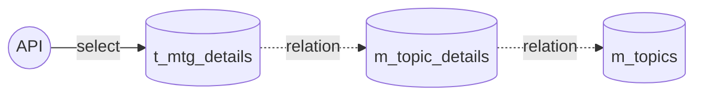
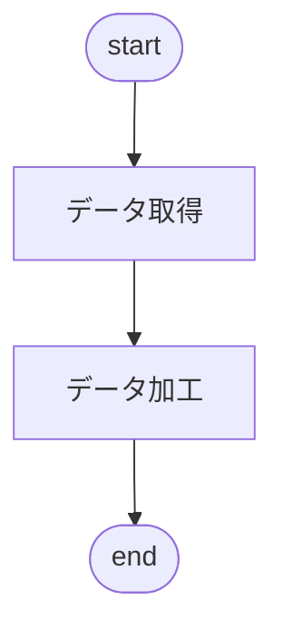
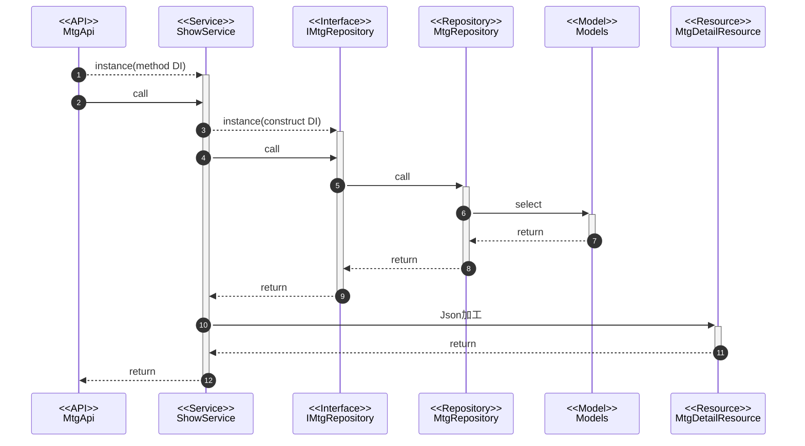

@import "../../090.other/md-css/markdown.less"

# API-007

## MTG 実施履歴詳細検索 API

### 処理概要

- MTG の子情報を取得

### データアクセス

#### 注意点

- t_mtg_details
  - 同じ`mtg_id`で異なる`topic_detail_id`を保持する
  - `topic_detail_id`は画面で選択された 1 ラジオボタン分しか存在しない
    - ラジオボタンで選択可能なのは 1 つのみのため
  - `topic_detail_id`は`m_topics`数分存在する



#### t_mtg_details(ミーティング詳細)

- 編集なし

#### m_topic_details(トピック詳細)

- 編集なし

#### m_topics(トピック)

- 編集なし

### 処理フロー

#### フローチャート



#### 処理シーケンス



### Request

#### URI

- GET
  - api/my-goal/v1/mtgs/{mtg_id}

#### path params

- mtg_id

#### body params

##### base

#### sample json

```json5
{}
```

### Response

#### 200 ステータス

##### base

| key     | type   | value             | note |
| :------ | :----- | :---------------- | :--- |
| data    | array  | MtgDetailResource |      |
| message | string | 検索完了しました  |      |

##### MtgDetailResource

| key               | type   | value                   | note |
| :---------------- | :----- | :---------------------- | :--- |
| topic_id          | int    | m_topics.id             |      |
| topic_name        | string | m_topics.name           |      |
| topic_detail_id   | int    | m_topic_details.id      |      |
| topic_detail_name | string | m_topic_details.name    |      |
| from_memo         | string | t_mtg_details.from_memo |      |
| to_memo           | string | t_mtg_details.to_memo   |      |

##### sample json

```json5
{
  data: [
    {
      id:1,
      mtg_date: "2023-08-01",
      status: 0,
      status_name: "未実施",
      from_user_id: 1,
      from_user_name: "ZZZ",
      to_user_id: 2,
      to_user_name: "XXXXX",
    }
  ]
  message: '検索完了しました',
}
```

#### 503 ステータス

- Laravel 側の**想定内の例外**は handler.php で制御している
  - 要求を処理できないことを示す 503 ステータスを使用
- 独自例外クラスの AppException を throw したら、下の形式で返される

```json5
{
  message: '※throwされたメッセージ',
}
```

#### 500 ステータス

- Laravel 側の**想定外の例外**は handler.php で制御しているため考慮不要

```json5
{
  message: 'uncatch exception'
  errorFile: '',
  errorLine: '',
  errorDetail: '',
}
```
