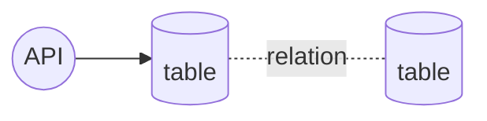
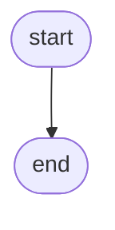
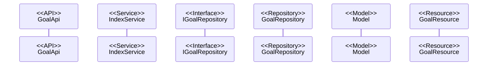

@import "../../090.other/md-css/markdown.less"

# API-XXX

## XXXXX API

### 処理概要

- XXXXXXX

### データアクセス



#### t_goals(ユーザーマスタ)

- deleted_at = is null

### 処理フロー

#### フローチャート



#### 処理シーケンス



### Request

#### path params

なし

#### body params

なし

#### sample json

なし

### Response

#### 200 ステータス

##### base

| key     | type   | value | note |
| :------ | :----- | :---- | :--- |
| data    | array  |       |      |
| message | string |       |      |

##### sample json

```json5
{}
```

#### 503 ステータス

- Laravel 側の**想定内の例外**は handler.php で制御している
  - 要求を処理できないことを示す 503 ステータスを使用
- 独自例外クラスの AppException を throw したら、下の形式で返される

```json5
{
  message: '※throwされたメッセージ',
}
```

#### 500 ステータス

- Laravel 側の**想定外の例外**は handler.php で制御しているため考慮不要

```json5
{
  message: 'uncatch exception'
  errorFile: '',
  errorLine: '',
  errorDetail: '',
}
```
